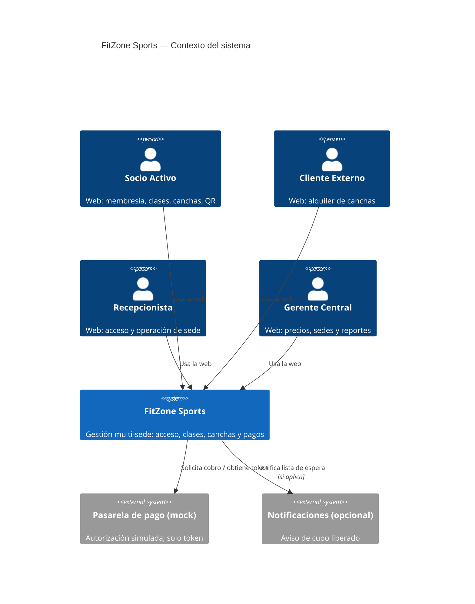
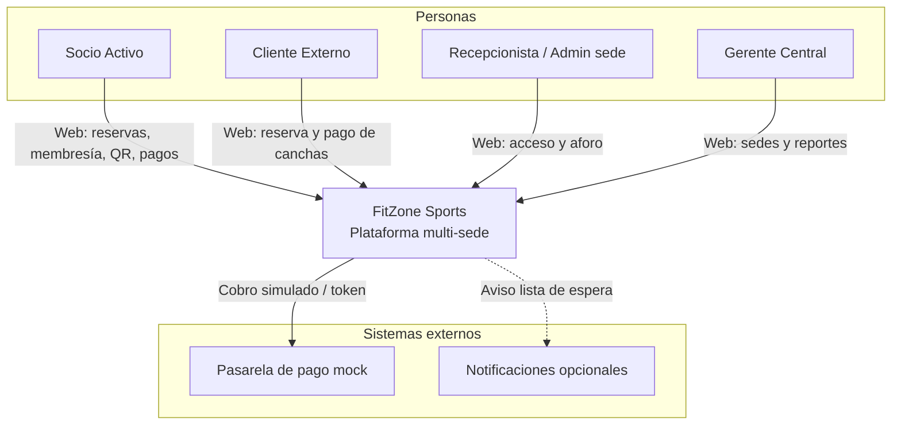
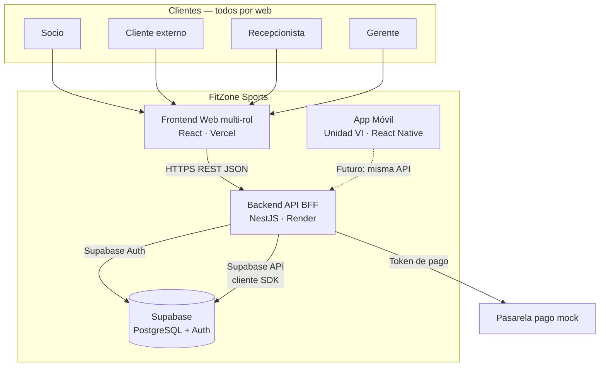
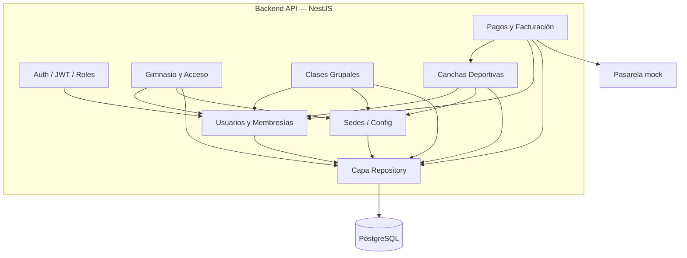
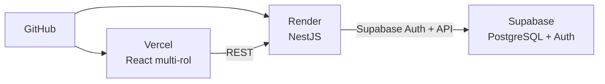

# Modelado C4 — FitZone Sports (propuesta)

Propuesta de arquitectura con el modelo **C4** (Context, Containers, Components). Sirve como base del entregable de **Unidad I** (diagramas C4 + ADR).

**Estado:** actualizado tras feedback docente 2026-08-28 · revisión grupal pendiente  
**Arquitectura:** monolito modular Nest
**Canal principal:** aplicación **web multi-rol** (A1–A4)  
**Móvil:** React Native · diferido a Unidad VI  
**Datos:** PostgreSQL en Supabase vía **API de Supabase** (sin ORM)  
**Auth:** Supabase Auth vía pasarela Nest  
**Stack de referencia:** [Stack tecnológico y herramientas](./Stack_Tecnologico_y_Herramientas.md)  
**Decisiones formales:** [Índice de ADR](./ADR_Indice.md)

| Nivel C4      | Pregunta                                           | ¿Incluido?                     |
| ------------- | -------------------------------------------------- | ------------------------------ |
| 1. Context    | ¿Quién usa el sistema y qué sistemas externos hay? | Sí                             |
| 2. Containers | ¿Qué aplicaciones / BD / apps se despliegan?       | Sí                             |
| 3. Components | ¿Cómo se parte el monolito NestJS?                 | Sí (propuesta)                 |
| 4. Code       | Clases / interfaces concretas                      | No (queda para implementación) |

---

## 1. Nivel Context (sistema en su entorno)

### Descripción

**FitZone Sports** es una plataforma integral de gestión para una cadena de gimnasios (25+ sedes). Unifica horarios de gimnasio, clases grupales y alquiler de canchas.

El canal de uso previsto para el desarrollo y la demo del curso es la **aplicación web**: todos los roles (socio, cliente externo, recepcionista y gerente) operan por web. La **app móvil** del enunciado se aborda recién en **Unidad VI** (cerca del cierre) y no condiciona el diseño ni el MVP del resto del cuatrimestre.

### Personas (actores)

| ID  | Actor                          | Relación con el sistema                                                                          |
| --- | ------------------------------ | ------------------------------------------------------------------------------------------------ |
| A1  | Socio Activo                   | Usa la **web**: membresía, clases, canchas con descuento, pagos; QR (web y/o móvil en Unidad VI) |
| A2  | Cliente Externo                | Usa la **web**: alquiler de canchas a tarifa plena y pagos                                       |
| A3  | Recepcionista / Admin. de Sede | Usa la **web**: acceso QR, aforo, operación diaria de su sede                                    |
| A4  | Gerente Central                | Usa la **web**: sedes, precios, reportes consolidados                                            |

### Sistemas externos

| Sistema                          | Rol                                                                      |
| -------------------------------- | ------------------------------------------------------------------------ |
| Pasarela de pago simulada        | Mock tipo MercadoPago / Modo: autoriza pagos y devuelve token (RNF-02)   |
| (Opcional) Canal de notificación | Email / in-app para lista de espera (RF-08); puede ser mock o log en MVP |

### Diagrama — Context

> Si el visor no renderiza `C4Context`, usar el diagrama equivalente en flowchart más abajo.

### Diagrama — Context (Mermaid flowchart, compatible)

---

## 2. Nivel Containers (aplicaciones y datos)

### Contenedores propuestos

| Contenedor      | Tecnología                      | Hosting  | Prioridad                 | Responsabilidad                                            |
| --------------- | ------------------------------- | -------- | ------------------------- | ---------------------------------------------------------- |
| Frontend Web    | React + TypeScript              | Vercel   | **Alta (camino crítico)** | UI multi-rol: A1, A2, A3 y A4                              |
| Backend API     | NestJS (monolito modular) · BFF | Render   | **Alta**                  | Reglas de negocio, REST, pasarela a Supabase Auth, Swagger |
| Persistencia    | PostgreSQL vía **Supabase API** | Supabase | **Alta**                  | Tablas de dominio; Nest usa cliente SDK (no ORM)           |
| Identidad       | Supabase Auth                   | Supabase | **Alta**                  | Login/tokens; solo a través de Nest (BFF)                  |
| App Móvil Socio | React Native                    | APK demo | **Baja — Unidad VI**      | QR dinámico / seed TOTP; no bloquea el resto               |

**Fuera de contenedores de runtime pero parte del ecosistema de desarrollo:** GitHub (código + CI).

### Diagrama — Containers

### Flujos principales entre contenedores

| Flujo                               | Origen → Destino                                        | Notas                                                                 |
| ----------------------------------- | ------------------------------------------------------- | --------------------------------------------------------------------- |
| Login / roles                       | Web → Nest BFF → Supabase Auth (+ perfil/rol en tablas) | Front no llama Supabase directo; guards A1–A4 en Nest                 |
| Reserva de cancha (socio o externo) | Web → Nest → Supabase API                               | Evitar sobreventa (RN-02); preferir RPC/transacción SQL si hace falta |
| Precio dinámico                     | Nest (Strategy)                                         | Socio −15%, externo tarifa plena, pico 19–21 hs                       |
| Pago                                | Nest → Pasarela mock → Nest → Supabase API              | Sin datos de tarjeta (RNF-02)                                         |
| Validación de acceso / aforo        | Web (A3) → Nest → Supabase API                          | Membresía activa; RN-01                                               |
| QR del socio                        | Web (A1); móvil en Unidad VI                            | TOTP / generación; ver Decisiones pendientes §8                       |
| Lista de espera                     | Nest (Observer)                                         | Notifica al liberar cupo                                              |
| Nueva sede                          | Web (A4) → Nest → Supabase API                          | Sin redeploy (RNF-04)                                                 |

### Decisiones de contenedores (resumen)

- **Un solo backend:** monolito modular Nest (no microservicios), como **BFF**.
- **Persistencia:** PostgreSQL en Supabase; acceso por **API de Supabase** (no ORM).
- **Auth:** Supabase Auth vía pasarela Nest.
- **Web first multi-rol:** React cubre A1–A4.
- **Móvil diferido:** React Native en Unidad VI.
- **Hosting:** Vercel (front) · Render (API) · Supabase (BD + Auth).

---

## 3. Nivel Components — Backend API (NestJS)

Propuesta de módulos internos del monolito. Cada módulo agrupa controllers, services y repositorios del dominio.

### Componentes

| Componente            | Módulo funcional | Responsabilidad                                          |
| --------------------- | ---------------- | -------------------------------------------------------- |
| Auth / Seguridad      | transversal      | BFF: pasarela Supabase Auth, JWT, guards por rol (A1–A4) |
| Usuarios y Membresías | M1               | Perfiles, planes, estados Activo/Vencido/Suspendido      |
| Gimnasio y Acceso     | M2               | Validación QR, presencia en sede, aforo                  |
| Clases Grupales       | M3               | Agenda, cupos, lista de espera (Observer)                |
| Canchas Deportivas    | M4               | Recursos, grilla, mantenimiento, precios (Strategy)      |
| Pagos y Facturación   | M5               | Mock pasarela, tokens, PDF comprobante                   |
| Sedes / Configuración | transversal / A4 | Alta de sedes, parámetros globales                       |
| Capa Repository       | transversal      | Acceso a datos vía **cliente Supabase API** (sin ORM)    |

### Diagrama — Components (Backend)

### Patrones GoF ubicados en components

| Patrón         | Dónde                    | Para qué                                                      |
| -------------- | ------------------------ | ------------------------------------------------------------- |
| **Strategy**   | Canchas / precios        | `StandardPricing`, `MemberDiscountPricing`, `PeakHourPricing` |
| **Observer**   | Clases / lista de espera | Notificar al liberar cupo                                     |
| **Repository** | Capa de datos            | Desacoplar servicios de PostgreSQL                            |

---

## 4. Vista de despliegue (complementaria al C4)

No es un nivel C4 formal, pero aclara el entorno de demo/producción del **camino crítico** (web + API + BD).

| Entorno     | Front              | API                | BD             |
| ----------- | ------------------ | ------------------ | -------------- |
| Local       | `localhost` (Vite) | `localhost` (Nest) | Supabase (dev) |
| Demo / prod | Vercel             | Render             | Supabase       |

---

## 5. Alcance offline (RNF-01) en el modelo

| Contenedor            | Comportamiento propuesto                                       |
| --------------------- | -------------------------------------------------------------- |
| Frontend Web          | Requiere conectividad; es el canal principal del curso         |
| Backend               | Requiere conectividad                                          |
| App Móvil (Unidad VI) | Único lugar previsto para cache local del QR / offline acotado |
| BD                    | Centralizada en Supabase                                       |

El offline **no** es prioridad hasta Unidad VI. Detalle en [Decisiones pendientes](./Decisiones_Pendientes_y_Cosas_a_Definir.md).

---

## 6. Trazabilidad a requisitos

| Requisito / regla                | Nivel C4 donde se ve                           |
| -------------------------------- | ---------------------------------------------- |
| Actores A1–A4 vía web            | Context + Container Frontend Web               |
| RF-01…RF-14 (módulos M1–M5)      | Components del backend + pantallas web por rol |
| RN-01 (una sede a la vez)        | Component Acceso + DB                          |
| RN-02 (sin sobreventa)           | Component Canchas + PostgreSQL transaccional   |
| RN-03 (mora)                     | Membresías + Strategy de precios               |
| RNF-01 (offline)                 | Contenedor móvil diferido (Unidad VI)          |
| RNF-02 (sin tarjeta local)       | Container API ↔ Pasarela mock                  |
| RNF-04 (nueva sede sin downtime) | Component Sedes + datos en DB                  |

---

## 7. Próximos pasos sugeridos

1. ~~Confirmar canal web vs móvil para A1/A2~~ — **cerrado:** web multi-rol; móvil en Unidad VI.
2. Diseñar pantallas web por rol (A1–A4) en Unidad IV.
3. Revisar ADR ya redactados — [Índice de ADR](./ADR_Indice.md).
4. Exportar diagramas a imagen/PDF si la entrega lo pide en ese formato.
5. ~~React Native vs Flutter~~ — **cerrado:** React Native.
6. Actualizar alcance offline (RNF-01 sede + TOTP) según [Decisiones pendientes §8](./Decisiones_Pendientes_y_Cosas_a_Definir.md).
7. Exportar diagramas a imagen/PDF si la entrega lo pide.

---

## Referencias

- [Trabajo Integrador — FitZone Sports](./Trabajo_Integrador_FitZone_Sports.md)
- [Funcionalidades por actor](./Funcionalidades_por_Actor.md)
- [Stack tecnológico y herramientas](./Stack_Tecnologico_y_Herramientas.md)
- [Índice de ADR](./ADR_Indice.md)
- [Decisiones pendientes](./Decisiones_Pendientes_y_Cosas_a_Definir.md)
- [C4 Model — Simon Brown](https://c4model.com/)

---

*Propuesta C4 · FitZone Sports · Programación V · UNER*