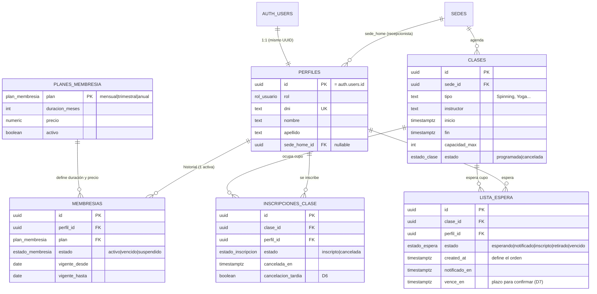

# Diseño de base de datos — Membresías, Clases, Cupos y Perfiles (S3-T06)

**Estado:** decisiones cerradas (salvo D5). Migración probada en PostgreSQL local y **ejecutada en Supabase el 2026-10-05**, con seed cargado.  
**Fecha:** 2026-10-05  
**Tarea:** S3-T06 (bloquea S3-T03 Membresías, S3-T04 Clases y S3-T07 Mi Perfil)  
**Migración:** [`supabase/migrations/20261005220000_membresias_clases.sql`](../supabase/migrations/20261005220000_membresias_clases.sql)  
**Referencias:** [Propuesta ER](./Propuesta_ER_FitZone.md) · [Trabajo Integrador](./Trabajo_Integrador_FitZone_Sports.md) (RF-01 a RF-08, RN-03) · [Funcionalidades por actor](./Funcionalidades_por_Actor.md) · [ADR-006](./adr/ADR-006-supabase-api-sin-orm.md)

---

## 1. Alcance

Cubre las tablas que necesitan los módulos **M1 (Usuarios y Membresías)** y **M3 (Clases Grupales)** en la Semana 3:

- Ajustes a `perfiles` y `membresias` (ya existen).
- Nuevas: `planes_membresia`, `clases`, `inscripciones_clase`, `lista_espera`.
- Funciones SQL para reservar, cancelar y confirmar cupos sin sobreventa.

Fuera de alcance: acceso/QR (M2), canchas (M4), pagos (M5).

---

## 2. Estado actual en Supabase (verificado 2026-10-05)

| Tabla | Columnas | Filas |
|-------|----------|-------|
| `sedes` | `id`, `nombre`, `direccion`, `aforo_max`, `activa`, `created_at` | 2 |
| `perfiles` | `id` (FK `auth.users`), `rol` (enum `socio\|externo\|recepcionista\|gerente`), `dni`, `nombre`, `apellido`, `telefono`, `foto_url`, `sede_home_id` (FK `sedes`), `created_at` | **0** |
| `membresias` | `id`, `perfil_id` (FK `perfiles`), `plan` (enum `mensual\|trimestral\|anual`), `estado` (enum `activo\|vencido\|suspendido`), `vigente_desde`, `vigente_hasta`, `created_at` | **0** |

Coincide con la Fase A de la [Propuesta ER](./Propuesta_ER_FitZone.md#3-diagrama-er--fase-a-núcleo-mínimo).

**Observaciones:**

- `perfiles` está vacía: el usuario de prueba de Auth no tiene perfil y no hay gerente cargado (el seed de S2-T03 no quedó en la base).
- `sedes` se puede leer con la clave pública (`anon`). Se corrige con D8.
- La migración quita `UNIQUE(perfil_id)` de `membresias` asumiendo el nombre por defecto (`membresias_perfil_id_key`). Si en Supabase tiene otro nombre, verificar en el dashboard antes de ejecutar.

---

## 3. Decisiones

| # | Tema | Decisión |
|---|------|----------|
| **D1** | Historial de membresías | Varias filas por socio; **a lo sumo una `activo`** (índice único parcial). Cada renovación es una fila nueva. |
| **D2** | Precio y duración de los planes | Tabla **`planes_membresia`**. Precios de ejemplo en la migración, a definir por el equipo. |
| **D3** | Estado `vencido` | **Calculado en Nest** (`vigente_hasta < hoy`). La columna registra `suspendido` y el cierre de una membresía al renovar. |
| **D4** | Tipo de clase | **Texto libre** (`clases.tipo`). |
| **D5** | Ventana de reserva "hasta 48 hs antes" (RF-07) | **Pendiente — hay duda.** Consultar al docente: ¿la reserva *abre* 48 h antes del inicio, o *cierra* 48 h antes? No afecta el esquema: es una validación de fechas en Nest. |
| **D6** | Cancelación con menos de 2 h | **Se permite y queda registrada** (`inscripciones_clase.cancelacion_tardia`). La penalidad se define más adelante. |
| **D7** | Cupo liberado y lista de espera (RF-08) | **Se notifica al primero de la lista y tiene un plazo para confirmar.** Sin inscripciones automáticas. |
| **D8** | Seguridad de las tablas (RLS) | **RLS activado en todas las tablas, sin políticas.** Solo el backend accede (clave secreta). |
| **D9** | Alta del perfil al registrarse | **Nest** crea el usuario en Auth y después el perfil; si falla el perfil, borra el usuario. |
| **D10** | Sedes del recepcionista | **Una sola** (`perfiles.sede_home_id`). |

### Cómo funciona la lista de espera (D7)

1. Si la clase está llena, el socio se anota en `lista_espera` (estado `esperando`).
2. Cuando se libera un lugar (cancelación), el primero en la lista pasa a `notificado` con un plazo (`vence_en`). **Su lugar queda reservado:** nadie más puede tomarlo mientras el plazo no venza.
3. Nest le avisa (Observer, S4-T02).
4. Si confirma a tiempo, queda inscripto. Si el plazo vence, pasa a `vencido` y se notifica al siguiente.
5. Mientras haya gente `esperando`, nadie puede reservar directo: tiene que anotarse en la lista.

El plazo nunca supera el inicio de la clase. Su duración **no está fija en la base**: Nest la pasa como parámetro, así se configura sin migraciones.

---

## 4. Diagrama ER

**Cupos:** no se guarda un contador. Lugares ocupados = inscripciones `inscripto` + notificados de la lista con plazo vigente. La vista `clases_con_cupo` expone `cupos_libres` y `en_espera` para `GET /clases`.

---

## 5. Dónde se valida cada regla

| Regla | Base de datos | Nest |
|-------|---------------|------|
| Un perfil por usuario de Auth | PK `perfiles.id` = FK `auth.users.id` | — |
| DNI único | `UNIQUE (dni)` | Mensaje claro si se repite |
| Una membresía activa por socio (D1) | Índice único parcial `where estado = 'activo'` | Al renovar, cierra la anterior |
| Sin sobreventa de cupos (RF-07) | Funciones que bloquean la fila de la clase | Llama a las funciones por RPC |
| Una inscripción vigente por socio y clase | Índice único parcial `where estado = 'inscripto'` | — |
| Orden y plazos de la lista de espera (D7) | Funciones `procesar_lista_espera`, `cancelar_inscripcion`, `confirmar_lugar_espera` | Define el plazo y notifica |
| Cancelación tardía (D6) | Columna `cancelacion_tardia` | Calcula si faltan menos de 2 h |
| Ventana de reserva (D5) | — | Validación de fechas (pendiente de definir) |
| Solo socios con membresía activa reservan clases (RN-03) | — | Consulta la membresía antes de reservar |

Llamar funciones SQL por RPC (`supabase.rpc(...)`) sigue siendo "API de Supabase sin ORM" (ADR-006). Resuelve la concurrencia que una consulta y un insert separados no pueden garantizar.

### Funciones disponibles para el backend

Solo las puede ejecutar `service_role` (el backend). Los errores de negocio llegan como mensaje de la excepción.

| Función | Uso | Errores |
|---------|-----|---------|
| `inscribir_en_clase(clase_id, perfil_id)` | Reserva directa | `CLASE_NO_EXISTE`, `CLASE_CANCELADA`, `HAY_LISTA_DE_ESPERA`, `CLASE_LLENA`, unique violation si ya está inscripto |
| `cancelar_inscripcion(inscripcion_id, cancelacion_tardia, plazo)` | Cancela y notifica al siguiente. Devuelve los notificados | `INSCRIPCION_NO_EXISTE`, `INSCRIPCION_NO_VIGENTE` |
| `confirmar_lugar_espera(espera_id)` | El notificado confirma su lugar | `ESPERA_NO_EXISTE`, `ESPERA_NO_NOTIFICADA`, `PLAZO_VENCIDO` |
| `procesar_lista_espera(clase_id, plazo)` | Vence plazos y notifica a los siguientes. Devuelve los notificados | `CLASE_NO_EXISTE` |

`procesar_lista_espera` conviene llamarla antes de mostrar o reservar una clase, para que los plazos vencidos se resuelvan sin necesidad de tareas programadas.

---

## 6. Pruebas

La migración se probó en un PostgreSQL 18 local, sobre una réplica de la Fase A (`supabase/tests/00_fase_a_simulada.sql`). El script [`supabase/tests/membresias_clases.test.sql`](../supabase/tests/membresias_clases.test.sql) verifica:

1. Historial de membresías permitido; una segunda activa se rechaza.
2. Clase llena: la reserva se rechaza.
3. Cancelación tardía registrada; se notifica al primero de la lista y su lugar queda reservado.
4. Nadie se adelanta a la lista de espera.
5. El notificado confirma a tiempo y queda inscripto.
6. Fuera de plazo no puede confirmar.
7. Al procesar la lista, el plazo vencido libera el lugar.
8. Doble inscripción rechazada.
9. RLS: la clave pública no ve tablas ni ejecuta funciones.

---

## 7. Datos de prueba en Supabase (seed 2026-10-05)

| Dato | Detalle |
|------|---------|
| Socio | Usuario de prueba de Auth, perfil `socio` (DNI 30000001) |
| Gerente | `gerente@fitzone.com`, perfil `gerente`, sede FitZone Central. Contraseña: pedirla a P1 (no va en el repo) |
| Membresías del socio | Mensual `vencido` (septiembre) y mensual `activo` (2026-10-01 a 2026-10-31) |
| Clases | Spinning (Central, 07/10 18 h, **capacidad 1** para probar lista de espera), Yoga (Central, 08/10 9 h, 15), Funcional (Norte, 07/10 19 h, 10) |

---

## 8. Pendientes

| Tema | Responsable sugerido |
|------|----------------------|
| D5: interpretación de "hasta 48 hs antes" | Consulta al docente |
| Duración del plazo para confirmar un lugar de la lista de espera (D7) | Equipo (se configura en Nest; ej. 30 min) |
| Penalidad por cancelación tardía (D6) | Equipo |
| Precios reales de los planes (D2) | Equipo |

---

## 9. Próximos pasos

1. Avisar a Bruno (S3-T03, S3-T04) y a Lucas (S3-T07) que pueden arrancar.
2. Resolver los pendientes de la sección 8.

---

*Diseño BD S3-T06 · FitZone Sports · Programación V · UNER*
