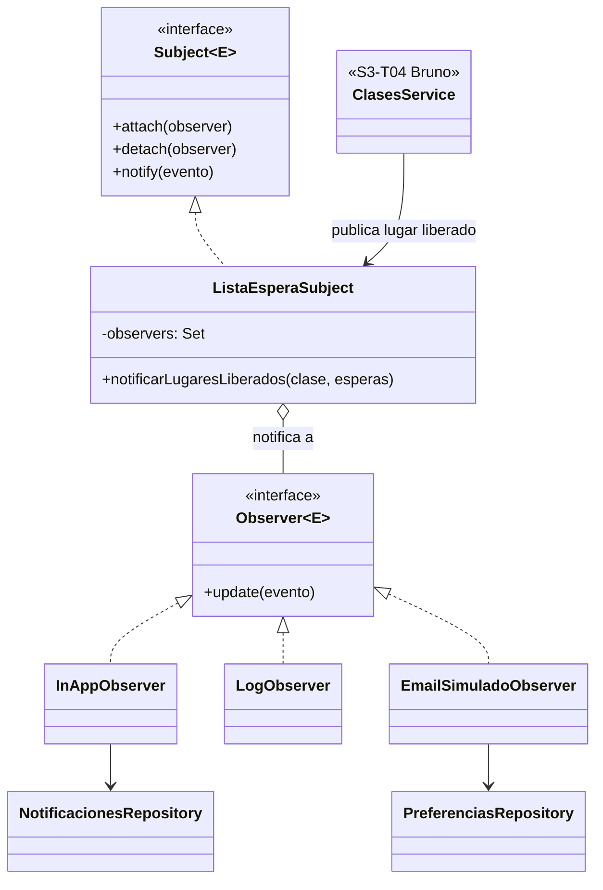

# Diseño: patrón Observer para la lista de espera (S4-T02)

**Responsable:** Patricio Ramos (P1)  
**Fecha:** 2026-10-06  
**Requisito:** RF-08 — al liberarse un lugar en una clase llena, se notifica al socio enlistado.  
**Relacionado:** [Diseño BD S3-T06](./Diseno_BD_S3-T06_Membresias_Clases.md) (D7), [Guía Repository](./Guia_Patron_Repository.md)

---

## 1. Decisiones (parte de S4-T09)

| Tema | Decisión |
|------|----------|
| Evento | Solo **lugar liberado**: al primero de la lista, con el plazo para confirmar (D7) |
| Canal | **In-app** siempre (tabla `notificaciones`, el socio las ve en la web) + **log** en la API |
| Email | **Simulado** (se registra en el log, no se envía), solo si el socio lo activa en su perfil (`perfiles.notificar_por_email`) |
| Implementación | Observer **GoF explícito** (interfaces propias `Subject` / `Observer`), sin librerías de eventos |

---

## 2. Estructura



- **Sujeto:** `ListaEsperaSubject` mantiene la lista de observadores y les reparte el evento `LugarLiberadoEvent`. No sabe qué hace cada uno.
- **Observadores concretos:** `InAppObserver` guarda la notificación; `LogObserver` deja registro; `EmailSimuladoObserver` consulta la preferencia y "envía" el mail al log.
- **Suscripción:** `NotificacionesModule.onModuleInit()` hace los `attach`. Agregar un canal nuevo (p. ej. push o email real) es crear otro observador y suscribirlo; Clases no cambia.
- **Fallas aisladas:** `notify` usa `Promise.allSettled`. Si un observador falla (p. ej. Supabase no responde), los demás se ejecutan igual, el error queda en el log y la cancelación que liberó el lugar **no se revierte**: el lugar ya quedó reservado en la base.

Código: `backend/src/notificaciones/`.

---

## 3. Integración con Clases (para S3-T04)

`cancelar_inscripcion` y `procesar_lista_espera` devuelven las filas de `lista_espera` que pasaron a `notificado`. Después de llamarlas, Clases se las pasa al sujeto:

```ts
// clases.module.ts
imports: [NotificacionesModule]

// clases.service.ts
constructor(
  private readonly clasesRepository: ClasesRepository,
  private readonly listaEspera: ListaEsperaSubject,
) {}

async cancelar(inscripcionId: string, clase: Clase) {
  const tardia = /* faltan menos de 2 h para clase.inicio (D6) */;
  const notificados = await this.clasesRepository.cancelar(inscripcionId, tardia, PLAZO_CONFIRMACION);
  await this.listaEspera.notificarLugaresLiberados(clase, notificados);
}
```

Lo mismo después de `procesar_lista_espera` (al listar o reservar una clase), porque ahí también se notifica al siguiente cuando vence un plazo.

---

## 4. Base de datos

Migración `supabase/migrations/20261006190000_notificaciones.sql`:

- `perfiles.notificar_por_email boolean default false`.
- Enum `tipo_notificacion` (`lugar_liberado`).
- Tabla `notificaciones`: `perfil_id`, `tipo`, `titulo`, `mensaje`, `datos` (jsonb con `espera_id`, `clase_id`, `vence_en` para que el front ofrezca "Confirmar lugar"), `leida_en`, `created_at`. RLS activado sin políticas (D8).

---

## 5. API (para el front, S3-T07 / Lucas)

Todas requieren `Authorization: Bearer <token>`; el usuario sale del token.

| Método y ruta | Qué hace |
|---------------|----------|
| `GET /notificaciones` | Lista las notificaciones del usuario, la más nueva primero |
| `PATCH /notificaciones/:id/leida` | Marca una como leída (404 si no existe o no es del usuario) |
| `GET /notificaciones/preferencias` | Devuelve `{ notificar_por_email }` |
| `PATCH /notificaciones/preferencias` | Body `{ "notificar_por_email": true }` |

---

## 6. Pendientes

- Duración del plazo de confirmación (`PLAZO_CONFIRMACION`, p. ej. 30 min): la define el equipo y la configura Clases.
- Envío de email real: fuera de alcance; sería otro observador.
