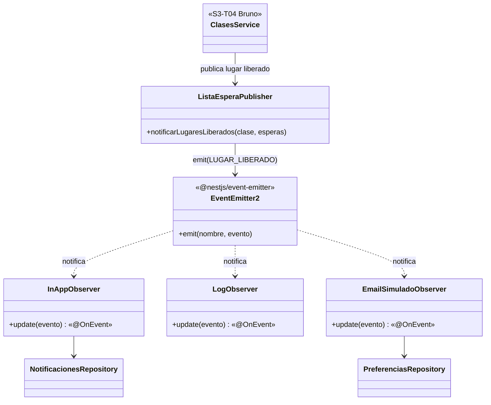

# Diseño: patrón Observer para la lista de espera (S4-T02)

**Responsable:** Patricio Ramos (P1)  
**Fecha:** 2026-10-06  
**Requisito:** RF-08 — al liberarse un lugar en una clase llena, se notifica al socio enlistado.  
**Relacionado:** [Diseño BD S3-T06](./Diseno_BD_S3-T06_Membresias_Clases.md) (D7), [Guía Repository](./Guia_Patron_Repository.md)

---

## 1. Decisiones (parte de S4-T09)

| Tema | Decisión |
|------|----------|
| Evento | Solo **lugar liberado**: al primero de la lista, con el plazo para confirmar (D7) |
| Canal | **In-app** siempre (tabla `notificaciones`, el socio las ve en la web) + **log** en la API |
| Email | **Simulado** (se registra en el log, no se envía), solo si el socio lo activa en su perfil (`perfiles.notificar_por_email`) |
| Implementación | Observer con el mecanismo de eventos del framework: **`@nestjs/event-emitter`** (ver 2.1) |

---

## 2. Estructura



| Rol GoF | En el código |
|---------|--------------|
| Sujeto (mantiene la lista y notifica) | `EventEmitter2` de la librería |
| Evento | `LugarLiberadoEvent`, con nombre `LUGAR_LIBERADO` (`lugar-liberado.event.ts`) |
| `attach` | El decorador `@OnEvent(LUGAR_LIBERADO)`: la librería registra el método al arrancar la app |
| `notify` | `ListaEsperaPublisher.notificarLugaresLiberados()`, que hace un `emit` por cada espera |
| Observadores concretos | `InAppObserver` (guarda la notificación), `LogObserver` (deja registro), `EmailSimuladoObserver` (consulta la preferencia y "envía" el mail al log) |

- **Agregar un canal** (p. ej. push o email real) es crear otra clase con un método `@OnEvent(LUGAR_LIBERADO)` y registrarla como provider. No se toca el publicador ni Clases.
- **Nombre del evento:** usar siempre la constante `LUGAR_LIBERADO`. Un texto mal escrito compila igual y nadie recibe el evento.

### 2.1 Por qué la librería y no un Observer propio

La primera versión tenía interfaces propias `Subject` / `Observer`. Se reemplazó porque la clase de Unidad III (diapositiva 46) marca como mala práctica "un Observer a mano habiendo eventos de dominio" en el framework: el propio no aportaba nada que la librería no diera. Además, con la librería Clases no depende de ningún sujeto con lista de observadores, y los observadores se suscriben solos.

### 2.2 Las tres decisiones de la diapositiva 37

| Decisión | Qué hacemos |
|----------|-------------|
| ¿Antes o después del commit? | **Después.** El evento se publica cuando `cancelar_inscripcion` / `procesar_lista_espera` ya terminaron en la base, así que nunca se avisa de un lugar que no quedó reservado. |
| ¿Mismo hilo o asíncrono? | **Asíncrono** (`@OnEvent(..., { async: true })`). `notificarLugaresLiberados` vuelve enseguida y los observadores corren después: la respuesta al socio que canceló no espera a Supabase ni al email. |
| ¿Qué pasa si se cae a mitad? | **Se acepta perder el aviso** (sin outbox, fuera de alcance). El lugar igual queda reservado en `lista_espera`; si el socio no confirma, vence el plazo y pasa al siguiente. Si un observador falla, la librería registra el error (`suppressErrors`, activo por defecto) y los demás se ejecutan igual. |

Código: `backend/src/notificaciones/`.

---

## 3. Integración con Clases (para S3-T04)

`cancelar_inscripcion` y `procesar_lista_espera` devuelven las filas de `lista_espera` que pasaron a `notificado`. Después de llamarlas, Clases se las pasa al publicador:

```ts
// clases.module.ts
imports: [NotificacionesModule]

// clases.service.ts
constructor(
  private readonly clasesRepository: ClasesRepository,
  private readonly listaEspera: ListaEsperaPublisher,
) {}

async cancelar(inscripcionId: string, clase: Clase) {
  const tardia = /* faltan menos de 2 h para clase.inicio (D6) */;
  const notificados = await this.clasesRepository.cancelar(inscripcionId, tardia, PLAZO_CONFIRMACION);
  this.listaEspera.notificarLugaresLiberados(clase, notificados); // sin await: los avisos corren aparte
}
```

Lo mismo después de `procesar_lista_espera` (al listar o reservar una clase), porque ahí también se notifica al siguiente cuando vence un plazo.

---

## 4. Base de datos

Migración `supabase/migrations/20261006190000_notificaciones.sql`:

- `perfiles.notificar_por_email boolean default false`.
- Enum `tipo_notificacion` (`lugar_liberado`).
- Tabla `notificaciones`: `perfil_id`, `tipo`, `titulo`, `mensaje`, `datos` (jsonb con `espera_id`, `clase_id`, `vence_en` para que el front ofrezca "Confirmar lugar"), `leida_en`, `created_at`. RLS activado sin políticas (D8).

---

## 5. API (para el front, S3-T07 / Lucas)

Todas requieren `Authorization: Bearer <token>`; el usuario sale del token.

| Método y ruta | Qué hace |
|---------------|----------|
| `GET /notificaciones` | Lista las notificaciones del usuario, la más nueva primero |
| `PATCH /notificaciones/:id/leida` | Marca una como leída (404 si no existe o no es del usuario) |
| `GET /notificaciones/preferencias` | Devuelve `{ notificar_por_email }` |
| `PATCH /notificaciones/preferencias` | Body `{ "notificar_por_email": true }` |

---

## 6. Pendientes

- Duración del plazo de confirmación (`PLAZO_CONFIRMACION`, p. ej. 30 min): la define el equipo y la configura Clases.
- Envío de email real: fuera de alcance; sería otro observador.
