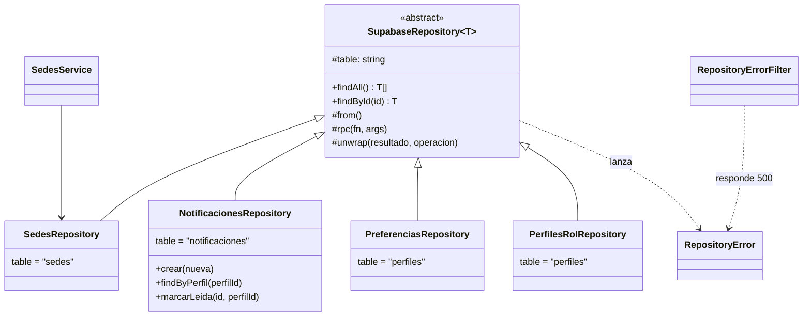
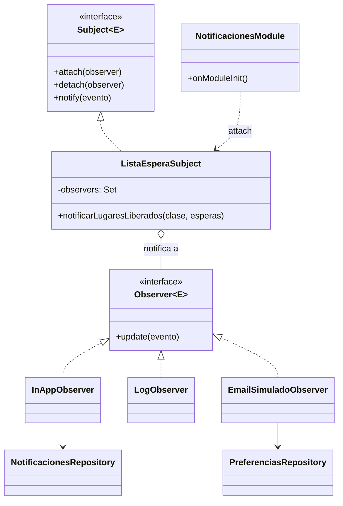
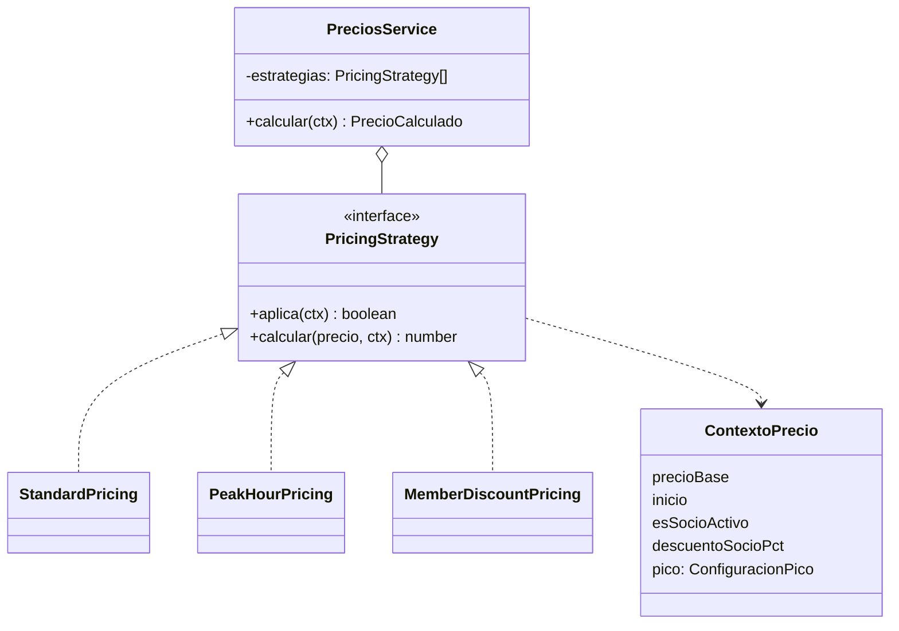

# Justificación de patrones de diseño — Unidad III (S4-T05)

**Proyecto:** FitZone Sports · Programación V · UNER  
**Responsable:** Patricio Ramos (P1)  
**Fecha:** 2026-10-06  
**Entregable:** Unidad III — código refactorizado con patrones + justificación

| Patrón | Dónde | Requisito | Estado |
|--------|-------|-----------|--------|
| [Repository](#1-repository--acceso-a-datos) | Toda la capa de datos del backend | ADR-006 | **Implementado** (S3-T11) |
| [Observer](#2-observer--lista-de-espera-de-clases) | Clases / lista de espera | RF-08 | **Implementado** (S4-T02) |
| [Strategy](#3-strategy--precio-de-canchas) | Canchas / precios | RF-11, RN-03 | **Diseñado**, implementación en S4-T01 |

Cada sección sigue el mismo orden: problema, por qué este patrón, alternativas descartadas, estructura, dónde está en el código, consecuencias y cómo se prueba.

---

## 1. Repository — Acceso a datos

### Problema

El backend lee y escribe en Supabase (PostgreSQL) con el cliente `@supabase/supabase-js`, sin ORM (ADR-006). Si cada servicio usa el cliente directamente:

- La lógica de negocio queda mezclada con detalles de PostgREST (`.from().select().eq()`), nombres de tablas y formato de errores.
- Cada servicio maneja los errores de Supabase a su manera. Antes del refactor, `SedesService` los convertía en un 500 genérico y **se perdía la causa real**.
- Para testear un servicio hay que simular la API encadenada del cliente.
- Cambiar de motor o de cliente obliga a tocar toda la lógica de negocio.

### Por qué Repository

Repository pone una capa que se comporta como una colección de objetos del dominio (`findAll`, `findById`, `crear`, `marcarLeida`) y oculta cómo se obtienen. Los servicios dependen de esa capa, no de Supabase.

> Repository no es uno de los 23 patrones GoF: proviene de *Patterns of Enterprise Application Architecture* (Fowler) y de DDD. La cátedra lo incluye en la Unidad III y lo pide la consigna (`BookingRepository`).

### Alternativas descartadas

| Alternativa | Por qué no |
|-------------|------------|
| Cliente Supabase en cada servicio | Es el problema descripto arriba |
| ORM (TypeORM / Prisma) | Descartado en ADR-006: el equipo decidió usar la API de Supabase |
| Un repositorio por tabla sin base común | Repite el manejo de errores y el log en cada uno |

### Estructura

- `SupabaseRepository<T>` resuelve lo común: `findAll`, `findById`, llamadas RPC y `unwrap`, que registra el error real en el log y lanza `RepositoryError`.
- Cada repositorio concreto define su tabla y sus consultas propias. `findAll` está escrito una vez en la base y cada subclase solo aporta `table`, que es la idea del **Template Method** (GoF).
- `RepositoryErrorFilter` convierte un `RepositoryError` no tratado en un 500 genérico, sin exponer detalles de la base al cliente.
- Los errores de negocio de las funciones SQL (`raise exception 'CLASE_LLENA'`) llegan como `RepositoryError` con su código, y el servicio los traduce a 404 o 409.

### Dónde está

- Base: `backend/src/supabase/supabase.repository.ts`, `repository.error.ts`, `repository-error.filter.ts`
- Concretos: `sedes/sedes.repository.ts`, `notificaciones/notificaciones.repository.ts`, `notificaciones/preferencias.repository.ts`, `auth/perfiles-rol.repository.ts`
- Guía para el equipo: [Guia_Patron_Repository.md](./Guia_Patron_Repository.md)

### Consecuencias

| Positivas | Negativas |
|-----------|-----------|
| Los servicios no conocen Supabase: un servicio de 3 líneas como `SedesService` | Una capa más para cada tabla nueva |
| Manejo de errores y log en un solo lugar | Las consultas complejas igual exigen conocer PostgREST dentro del repositorio |
| Servicios testeables con un mock simple del repositorio | `findAll`/`findById` heredados pueden no tener sentido en todas las tablas |
| Cambiar de cliente o de motor afecta solo a los repositorios | |

### Cómo se prueba

- `supabase.repository.spec.ts`: consulta la tabla correcta, `findById` devuelve `null` si no existe, `rpc` pasa los argumentos y un error de Supabase se convierte en `RepositoryError` y queda en el log.
- `sedes.service.spec.ts`: el servicio se prueba con el repositorio simulado.
- `test/sedes.e2e-spec.ts`: un error de Supabase responde 500 sin exponer el mensaje original.

---

## 2. Observer — Lista de espera de clases

### Problema

RF-08: si una clase está llena, el socio se anota en la lista de espera y, **cuando se libera un lugar, se le notifica**. La decisión D7 agrega que el socio tiene un plazo para confirmar, sin inscripciones automáticas, así que el aviso es indispensable.

El equipo decidió avisar por varios canales: in-app siempre, log, y email simulado si el socio lo activó. Si el módulo de Clases llamara a cada canal:

- Clases dependería de notificaciones, preferencias de perfil, email y log, que no son su responsabilidad.
- Agregar un canal (push, email real) obligaría a modificar Clases.
- Un canal que falla (p. ej. Supabase no responde al guardar la notificación) podría romper la cancelación que liberó el lugar.

### Por qué Observer

Observer define una relación uno a muchos: cuando el **sujeto** cambia de estado, avisa a todos sus **observadores** sin conocer qué hace cada uno. Clases solo publica "se liberó un lugar"; los canales se suscriben.

### Alternativas descartadas

| Alternativa | Por qué no |
|-------------|------------|
| Llamar a cada canal desde `ClasesService` | Acoplamiento descripto arriba |
| `@nestjs/event-emitter` | Implementa la misma idea, pero el patrón queda oculto en la librería. Preferimos interfaces propias para que cada pieza del patrón se vea en el código |
| Trigger en la base que inserte la notificación | Sirve para in-app, pero no para log ni email, y saca lógica de negocio del backend |
| Cola de mensajes (Redis, RabbitMQ) | Sobredimensionado para el alcance del proyecto |

### Estructura

| Rol GoF | Clase |
|---------|-------|
| Subject | `Subject<E>` (interfaz) |
| ConcreteSubject | `ListaEsperaSubject` |
| Observer | `Observer<E>` (interfaz) |
| ConcreteObserver | `InAppObserver`, `LogObserver`, `EmailSimuladoObserver` |
| Estado notificado | `LugarLiberadoEvent` (espera, socio, plazo, clase) |

- La suscripción (`attach`) se hace en `NotificacionesModule.onModuleInit()`.
- La base decide **a quién** notificar: las funciones `cancelar_inscripcion` y `procesar_lista_espera` devuelven las esperas que pasaron a `notificado`. El backend decide **cómo**: eso es el Observer.
- `notify` usa `Promise.allSettled`: si un observador falla, los demás se ejecutan igual, el error queda en el log y la cancelación no se revierte.

### Dónde está

- `backend/src/notificaciones/`: `observer.ts`, `lista-espera.subject.ts`, `lugar-liberado.event.ts`, `observers/`, `notificaciones.module.ts`
- Diseño completo e integración con Clases: [Diseno_Observer_S4-T02_Notificaciones.md](./Diseno_Observer_S4-T02_Notificaciones.md)

### Consecuencias

| Positivas | Negativas |
|-----------|-----------|
| Agregar un canal = un observador nuevo + `attach`; Clases no cambia (principio abierto/cerrado) | El orden entre observadores no está garantizado |
| Clases no depende de notificaciones ni de preferencias | El flujo es menos directo de seguir: hay que mirar qué está suscripto |
| Un canal que falla no afecta a los demás ni a la operación de negocio | Una falla de notificación queda solo en el log (no hay reintentos) |
| Cada observador se prueba por separado | |

### Cómo se prueba

- `lista-espera.subject.spec.ts`: notifica a todos los suscriptos, no notifica a un desuscripto, un observador que falla no frena a los demás.
- `observers/observers.spec.ts`: in-app guarda la notificación con los datos para confirmar; el email simulado respeta la preferencia del perfil.
- `test/notificaciones.e2e-spec.ts`: en la app real, los tres observadores quedan suscriptos y guardan la notificación.
- Prueba de punta a punta contra Supabase (2026-10-06): clase llena, lista de espera, cancelación, notificación in-app y por email simulado, y confirmación del lugar.

---

## 3. Strategy — Precio de canchas

> **Estado:** diseño acordado en [S4-T09](./Propuesta_Reglas_Negocio_S4-T09.md). Implementación a cargo de Bruno Conti en S4-T01. Completar la sección "Dónde está" y "Cómo se prueba" al integrarla.

### Problema

RF-11: el precio de una cancha es el precio estándar, con **descuento de socio** y **recargo en horario pico**. Según S4-T09:

- El descuento de socio (15% por defecto) lo configura el Gerente Central para toda la cadena.
- El recargo, el horario y los días pico los configura cada sede.
- Un socio con cuota vencida paga como externo (RN-03).
- Descuento y recargo se combinan (P4).

Resolverlo con condicionales en el servicio de reservas (`if (esSocio) … if (esPico) …`) concentra todas las reglas en un método que crece con cada regla nueva (p. ej. feriados o promociones) y es difícil de testear por partes.

### Por qué Strategy

Strategy encapsula cada algoritmo de cálculo en una clase con una interfaz común (`PricingStrategy`), y el contexto los usa sin conocer sus detalles. La consigna lo pide explícitamente: `StandardPricing`, `MemberDiscountPricing` y `PeakHourPricing`.

Como las reglas se combinan (P4), el servicio de precios no elige **una** estrategia: aplica en orden **todas las que corresponden**, y cada una recibe el precio que dejó la anterior.

### Alternativas descartadas

| Alternativa | Por qué no |
|-------------|------------|
| Condicionales en el servicio | Descripto arriba |
| Elegir una sola estrategia por reserva | No permite combinar descuento y recargo (P4) |
| Precio calculado en SQL | Las reglas de negocio quedarían fuera del backend y del patrón pedido |

### Estructura (propuesta)

| Rol GoF | Clase |
|---------|-------|
| Strategy | `PricingStrategy` |
| ConcreteStrategy | `StandardPricing`, `PeakHourPricing`, `MemberDiscountPricing` |
| Context | `PreciosService` |

### Consecuencias esperadas

| Positivas | Negativas |
|-----------|-----------|
| Una regla nueva (p. ej. feriados) es una clase nueva, sin tocar las demás | Más clases que un método con condicionales |
| Cada regla se prueba sola con los casos de S4-T09 | El orden de aplicación importa si se suman reglas no multiplicativas |
| Los parámetros (porcentajes, horarios) vienen de la base, no del código | |

### Casos de prueba acordados (base $20.000, valores por defecto)

| Cliente | Turno | Precio |
|---------|-------|--------|
| Externo | 17:00 | $20.000 |
| Externo | 19:00 | $24.000 |
| Socio activo | 17:00 | $17.000 |
| Socio activo | 20:00 | $20.400 |
| Socio con cuota vencida | 19:00 | $24.000 |

---

## 4. Otros patrones presentes en el código

No son el foco de la Unidad III, pero aparecen y conviene nombrarlos en la defensa:

| Patrón | Dónde |
|--------|-------|
| **Template Method** (GoF) | `SupabaseRepository<T>`: `findAll`/`findById` en la base, cada subclase aporta la tabla |
| **Inyección de dependencias** | Todo el backend (NestJS): servicios, repositorios, observadores |
| **Cadena de guards** | `JwtAuthGuard` → `RolesGuard` (`@RequiereRol`): cada uno valida algo y corta la cadena si falla, en el espíritu de **Chain of Responsibility** |
| **Decorator** (de TypeScript, no el GoF) | `@RequiereRol`, `@CurrentUser`: agregan comportamiento declarativo a controllers |
| **BFF** (arquitectura) | El frontend solo habla con Nest; Nest es la única puerta a Supabase (ADR-005) |

**Circuit Breaker**, mencionado por el docente, no se aplicó todavía. El candidato natural es la pasarela de pago simulada (M5).
