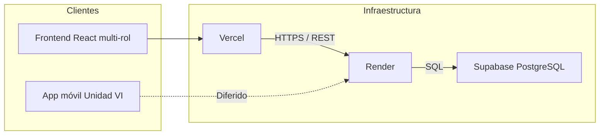

# Stack tecnológico y herramientas — FitZone Sports

Documento de definición tecnológica del proyecto integrador. Consolida las decisiones de arquitectura, frameworks, base de datos y herramientas de desarrollo y despliegue.

**Referencia:** [Trabajo Integrador — Caso FitZone Sports](./Trabajo_Integrador_FitZone_Sports.md)  
**Asignatura:** Programación V · Licenciatura en Sistemas · UNER  
**Arquitectura adoptada:** Monolito modular

---

## Resumen ejecutivo

| Capa | Tecnología | Hosting / servicio |
|------|------------|-------------------|
| Frontend Web (multi-rol A1–A4) | React | Vercel |
| Backend API (Monolito) | NestJS | Render |
| Base de datos | PostgreSQL | Supabase |
| Control de versiones | GitHub | — |
| App móvil | Diferida a Unidad VI | — |

**Alcance de canal:** la aplicación **web** es el producto principal del cuatrimestre y debe cubrir **todos los roles** (socio, cliente externo, recepcionista, gerente). La app móvil no condiciona el desarrollo de M1–M5.

---

## 1. Arquitectura general

El sistema sigue la decisión arquitectónica definida en el trabajo integrador: **monolito modular** con API REST centralizada y base de datos relacional única.



### Justificación (ADR resumido)

| Criterio | Decisión |
|----------|----------|
| Integridad transaccional | PostgreSQL con transacciones ACID para evitar sobreventa de canchas (RN-02) |
| Tamaño del equipo | Monolito modular; 4 integrantes |
| Time-to-market | Stack unificado en TypeScript (React + NestJS) |
| Escalabilidad operativa | Nueva sede configurable por base de datos (RNF-04) |

---

## 2. Frontend — React

| Aspecto | Definición |
|---------|------------|
| Framework | **React** (SPA) |
| Lenguaje | TypeScript |
| Alcance | **Aplicación web multi-rol** para A1, A2, A3 y A4 (no solo admin) |
| Patrón UI | Atomic Design (átomos → moléculas → organismos → templates → páginas) |
| Estado | Librería de estado global (p. ej. Zustand o Redux Toolkit) según complejidad del módulo |
| Consumo de API | Capa de servicios HTTP (fetch o axios) centralizada |
| Estilos | A definir en implementación (CSS Modules, Tailwind CSS u otro según convención del equipo) |

### Responsabilidades del frontend

- **A1 Socio:** perfil, membresía, clases, canchas con descuento, pagos, visualización de QR (en web)
- **A2 Cliente externo:** registro/acceso, grilla de canchas, reserva y pago a tarifa plena
- **A3 Recepcionista:** validación de acceso, aforo en tiempo real (RF-05), operación de sede
- **A4 Gerente:** sedes, precios, reportes consolidados, agenda/recursos según alcance
- Integración con la API REST documentada en Swagger
- Rutas y vistas condicionadas por rol (guards en front + JWT en API)

### Despliegue

| Servicio | Uso |
|----------|-----|
| **Vercel** | Hosting del build estático/SSR de React, previews por pull request y despliegue continuo desde GitHub |

**Variables de entorno en Vercel:** URL base de la API en Render (`VITE_API_URL` o equivalente según bundler).

---

## 3. Backend — NestJS

| Aspecto | Definición |
|---------|------------|
| Framework | **NestJS** (Node.js) |
| Lenguaje | TypeScript |
| Estilo arquitectónico | Monolito modular: módulos por dominio (usuarios, gimnasio, clases, canchas, pagos) |
| API | REST + documentación **Swagger/OpenAPI** (entregable Unidad II) |
| ORM | TypeORM o Prisma (a confirmar al iniciar scaffolding — Semana 3) |
| Validación | class-validator + class-transformer (convención NestJS) |
| Autenticación | JWT + guards por rol (socio, externo, recepcionista, gerente) |
| Patrones GoF | Strategy (precios), Observer (lista de espera), Repository (acceso a datos) |

### Módulos backend alineados al dominio

| Módulo NestJS | Requisitos funcionales |
|---------------|------------------------|
| Usuarios y Membresías | RF-01 a RF-03 |
| Gimnasio y Acceso | RF-04, RF-05 |
| Clases Grupales | RF-06 a RF-08 |
| Canchas Deportivas | RF-09 a RF-12 |
| Pagos y Facturación | RF-13, RF-14 |

### Despliegue

| Servicio | Uso |
|----------|-----|
| **Render** | Web Service para la API NestJS, despliegue automático desde rama principal de GitHub |

**Variables de entorno en Render:** cadena de conexión a Supabase, secretos JWT, URL del frontend (CORS).

---

## 4. Base de datos — PostgreSQL (Supabase)

| Aspecto | Definición |
|---------|------------|
| Motor | **PostgreSQL** |
| Proveedor | **Supabase** (PostgreSQL administrado + panel web + backups) |
| Esquema | Relacional normalizado; sedes, usuarios, membresías, reservas, pagos |
| Migraciones | Versionadas en el repositorio (TypeORM migrations o Prisma migrate) |
| Índices | Sobre consultas de disponibilidad de canchas (RNF-03) |
| Concurrencia | Transacciones y locks optimistas/pesimistas en reservas (RN-02) |

### Uso de Supabase en el proyecto

- Instancia PostgreSQL compartida por el equipo
- Consola web para inspección de datos en desarrollo
- Conexión desde NestJS vía cadena estándar `DATABASE_URL`
- **No** se utilizarán funcionalidades de Supabase Auth ni Realtime como reemplazo del backend NestJS; la lógica de negocio permanece en la API

---

## 5. Control de versiones — GitHub

| Aspecto | Definición |
|---------|------------|
| Plataforma | **GitHub** |
| Estrategia de ramas | `main` (producción) + ramas de feature por unidad/módulo |
| Repositorio | Monorepo o multirepo según acuerdo del equipo (recomendado: monorepo con `/frontend` y `/backend`) |
| Convenciones | Commits descriptivos vinculados a tareas; bitácora en `LOG.md` por integrante |
| Pull Requests | Revisión entre pares antes de merge a `main` |
| CI/CD | GitHub Actions (Unidad V): tests, lint y build en cada PR |

---

## 6. Herramientas complementarias de desarrollo

Herramientas no definidas como hosting pero previstas por el plan de trabajo integrador:

| Herramienta | Propósito |
|-------------|-----------|
| **Node.js** (LTS) | Runtime del backend y toolchain frontend |
| **npm** o **pnpm** | Gestión de dependencias |
| **Docker** | Contenedores locales y consistencia en CI/CD (Semana 12) |
| **Jest** | Pruebas unitarias e integración (backend y frontend) |
| **ESLint + Prettier** | Estilo y calidad de código |
| **Swagger UI** | Documentación interactiva de la API |
| **GitHub Actions** | Pipeline CI: test → build → (opcional) deploy |

---

## 7. App móvil (Unidad VI) — diferida y de baja prioridad

El enunciado contempla una app para socios (QR dinámico offline). En este proyecto:

- Se desarrolla **recién al final del curso** (Unidad VI, semanas 13–14).
- **No** condiciona el diseño ni la implementación de M1–M5.
- Toda la funcionalidad de negocio debe estar usable antes por la **web multi-rol**.
- Tecnología aún no cerrada (React Native vs Flutter); decisión al iniciar Unidad VI.

| Opción | Notas |
|--------|-------|
| React Native | Reutiliza conocimiento de React |
| Flutter | Alternativa válida del enunciado |

La app, si se entrega, consumirá la misma API NestJS. El requisito offline (RNF-01) se acota a ese entregable y no al camino crítico web.

---

## 8. Mapa de despliegue

```
┌─────────────────────────────────────────────────────────────┐
│                         GitHub                               │
│   Repositorio · PRs · GitHub Actions (CI)                   │
└──────────────┬──────────────────────────┬───────────────────┘
               │                          │
               ▼                          ▼
        ┌─────────────┐            ┌─────────────┐
        │   Vercel    │            │   Render    │
        │   (React)   │── REST ──▶ │  (NestJS)   │
        └─────────────┘            └──────┬──────┘
                                          │ SQL
                                          ▼
                                   ┌─────────────┐
                                   │  Supabase   │
                                   │ (PostgreSQL)│
                                   └─────────────┘
```

| Entorno | Frontend | Backend | Base de datos |
|---------|----------|---------|---------------|
| Desarrollo local | `localhost:5173` (Vite) o similar | `localhost:3000` | Supabase (proyecto dev) o PostgreSQL local |
| Producción / demo | `*.vercel.app` o dominio custom | `*.onrender.com` | Supabase (proyecto prod) |

---

## 9. Requisitos no funcionales — cobertura tecnológica

| ID | Requisito | Cómo lo cubre el stack |
|----|-----------|------------------------|
| RNF-01 | Disponibilidad / acceso offline | Diferido a app móvil (Unidad VI); el núcleo web+API asume conectividad |
| RNF-02 | Seguridad de pagos | Token de pasarela mock; sin almacenar datos de tarjeta en PostgreSQL |
| RNF-03 | Rendimiento en disponibilidad | Índices PostgreSQL; consultas optimizadas desde NestJS |
| RNF-04 | Escalabilidad por sedes | Configuración de sedes en BD; monolito stateless en Render |

---

## 10. Estructura de repositorio sugerida

```
FitZoneSports/
├── frontend/          # React + TypeScript
├── backend/           # NestJS + TypeScript
├── documentacion/     # C4, ADR, este documento, LOG.md
├── .github/
│   └── workflows/     # CI/CD
└── README.md
```

---

## 11. Decisiones pendientes

Detalle ampliado (opciones, cuándo decidir y checklists): [Decisiones pendientes y cosas a definir](./Decisiones_Pendientes_y_Cosas_a_Definir.md).

| Tema | Responsable sugerido | Plazo (cronograma) |
|------|---------------------|-------------------|
| ORM: TypeORM vs Prisma | P2 (Backend) | Semana 3 |
| Librería de estado en React | P3 (Frontend) | Semana 9 |
| Framework móvil: React Native vs Flutter | P4 (Mobile/DevOps) | Semana 13 |
| Solución de estilos (Tailwind, CSS Modules, etc.) | P3 | Semana 8 |
| Estrategia de mocks para pasarela de pago | P2 | Semana 4 |

---

## 12. Referencias

- [Trabajo Integrador — FitZone Sports](./Trabajo_Integrador_FitZone_Sports.md)
- [Funcionalidades por actor](./Funcionalidades_por_Actor.md)
- [Modelado C4 — propuesta](./C4_Arquitectura_FitZone.md)
- [Índice de ADR](./ADR_Indice.md)
- [Decisiones pendientes y cosas a definir](./Decisiones_Pendientes_y_Cosas_a_Definir.md)
- [NestJS — Documentación oficial](https://docs.nestjs.com/)
- [React — Documentación oficial](https://react.dev/)
- [Supabase — PostgreSQL](https://supabase.com/docs/guides/database)
- [Vercel — Deploy frontend](https://vercel.com/docs)
- [Render — Deploy Node](https://render.com/docs)

---

*Stack tecnológico · FitZone Sports · Programación V · UNER*
